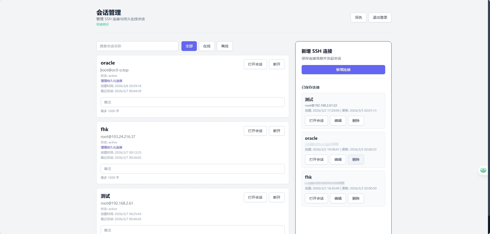
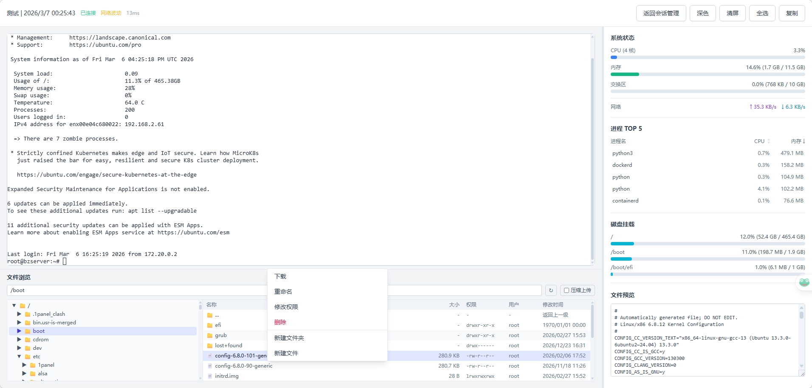
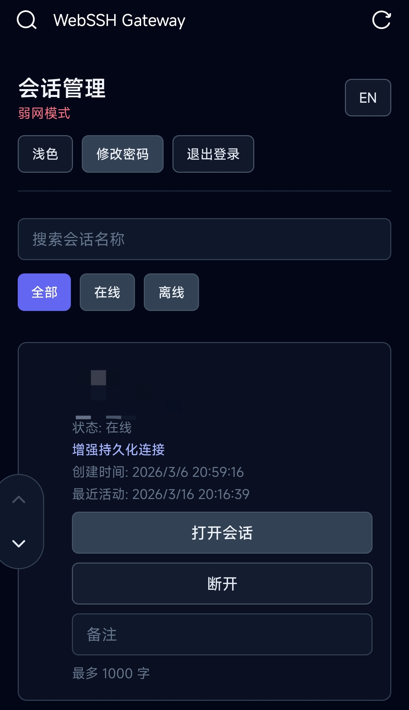
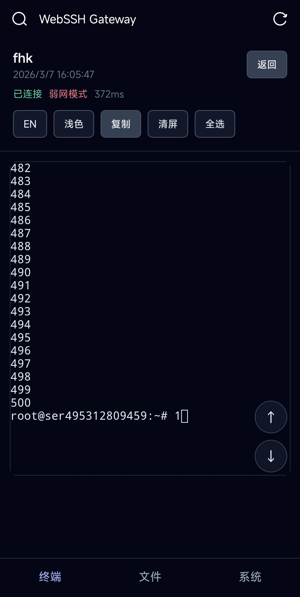
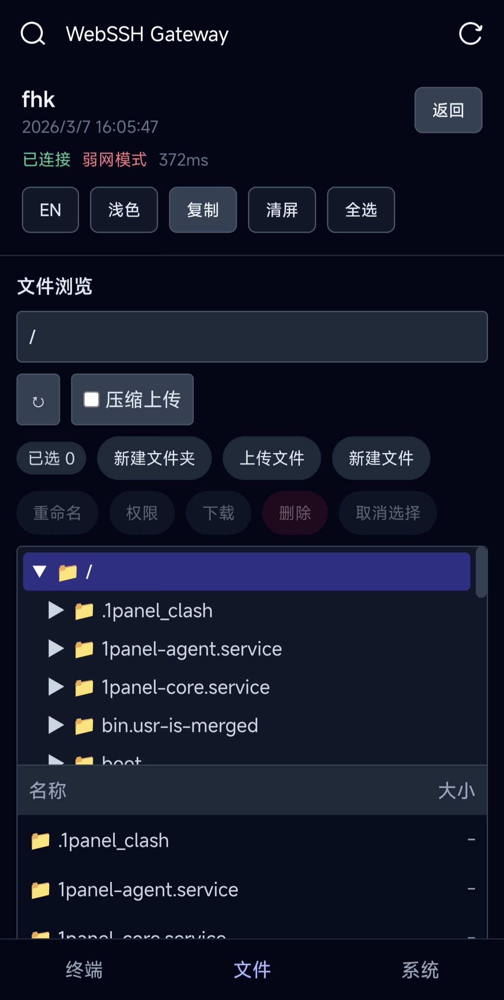
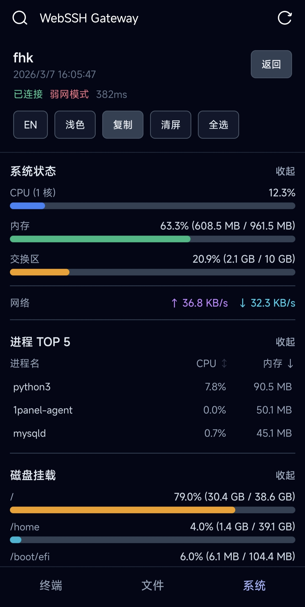

# WebSSH Gateway Community Edition

> English document. 中文文档请见：[README.md](./README.md)

WebSSH Gateway is a browser-based SSH gateway for operations and development teams. It provides SSH connection management, terminal sessions, system monitoring, and file operations in a single web interface.

One of its core capabilities is the persistent session design for long-running workloads. With enhanced sessions powered by `tmux`, background jobs can keep running even if the browser closes, the network briefly drops, or the page is refreshed. This is useful for long-lived scripts, AI coding workflows, scheduled data monitoring, log collection, and similar automation scenarios.

## Project Preview




## Mobile Experience

A dedicated mobile layout provides touch-friendly interactions for terminal work, file management, and system monitoring in phone browsers.






## Community Edition Notice

- This repository is the **Community Edition (CE)** of WebSSH Gateway.
- CE will remain open source and focused on core SSH gateway capabilities.
- There is an intention to explore a paid development direction in the future, but detailed scope and release timeline are **TBD**.
- The boundary between CE and any potential paid edition is **TBD**. CE remains independently deployable.

## Key Features

- Browser terminal with real-time WebSocket streaming
- Connection asset management with encrypted credentials
- Session lifecycle management with reconnect and notes
- Enhanced persistent session design powered by `tmux`, with keepalive and auto-retry
- Mobile-friendly experience for phone browsers with touch-first layouts and controls
- System monitoring for CPU, memory, network, process, and disk
- File management: browse, upload/download, rename, delete, chmod, batch upload
- Security baseline: JWT auth, password policy, lockout policy, request-id logging

## Tech Stack

- Backend: FastAPI + SQLAlchemy + AsyncSSH + SQLite
- Frontend: React + TypeScript + Vite + TailwindCSS + xterm.js
- Deployment: Docker / Docker Compose

## Quick Start

> Security notice: before deployment, you must replace `SECRET_KEY` in `.env` with your own strong random value. Never keep example/default values.

### Local Development

See [docs/DEPLOYMENT.en.md](./docs/DEPLOYMENT.en.md) for step-by-step setup.

### Docker Deployment

Docker Hub image: `https://hub.docker.com/r/beibeizi/websshgateway`

Quick start example (note: `SECRET_KEY` is an example, replace it in your own deployment; a 32‑char UUID is enough):

```bash
docker run -d -p 8080:8080 -e SECRET_KEY="67e457b4eab14012b34382b3d634f297" beibeizi/websshgateway:latest
```

```bash
export DOCKER_IMAGE=beibeizi/websshgateway:latest

# You can also build a local image yourself
docker build -t webssh-gateway:community .
docker run -d \
  --name webssh-gateway \
  -p 8080:8080 \
  --env-file .env \
  -v webssh-data:/data \
  ${DOCKER_IMAGE:-webssh-gateway:community}
```

## Documentation

- Architecture: [docs/ARCHITECTURE.en.md](./docs/ARCHITECTURE.en.md)
- Development & Deployment: [docs/DEPLOYMENT.en.md](./docs/DEPLOYMENT.en.md)
- Contributing: [CONTRIBUTING.md](./CONTRIBUTING.md)
- Chinese Readme: [README.md](./README.md)

## License

Licensed under [Apache-2.0](./LICENSE).
