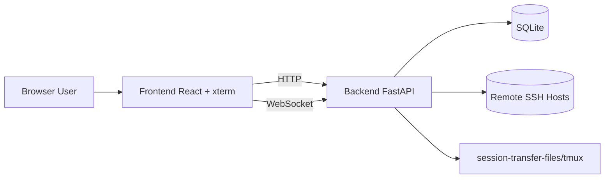

# Architecture (Community Edition)

> 中文版请见：[ARCHITECTURE.md](./ARCHITECTURE.md)

## 1. Overview

WebSSH Gateway follows a frontend-backend architecture:

- Frontend: user interaction, terminal UI, file and monitoring panels
- Backend: authentication, session orchestration, SSH bridge, and APIs

## 2. Backend Modules

- `app/main.py`: app bootstrap and route mounting
- `app/api/`: REST and WebSocket handlers
- `app/services/`: auth, crypto, SSH/session core logic
- `app/models/`: SQLAlchemy models
- `app/core/`: config, db, logging, state composition

## 3. Frontend Modules

- `src/pages/Login.tsx`
- `src/pages/Sessions.tsx`
- `src/pages/Terminal.tsx`
- `src/components/FileBrowser.tsx`
- `src/components/SystemMonitor.tsx`
- `src/lib/api.ts`
- `src/context/AppContext.tsx`

## 4. Critical Flows

- Auth flow: `/auth/login` -> JWT -> protected APIs
- Session flow: create session -> connect terminal WebSocket -> stream input/output
- Enhanced persistence: disconnected sessions are retried by background workers

## 5. Security Baseline

- AES-GCM encrypted credential storage
- JWT issuer validation
- Password policy and forced password change
- Lockout policy for repeated failed logins
- Request-id logging for traceability

## 6. CE vs Paid Edition

The Community Edition provides complete self-hosted core SSH gateway capabilities.
There is an intention to explore a paid development direction, while detailed scope, delivery model, and timeline are **TBD**.
Until then, CE continues as the independently deployable open-source edition.
