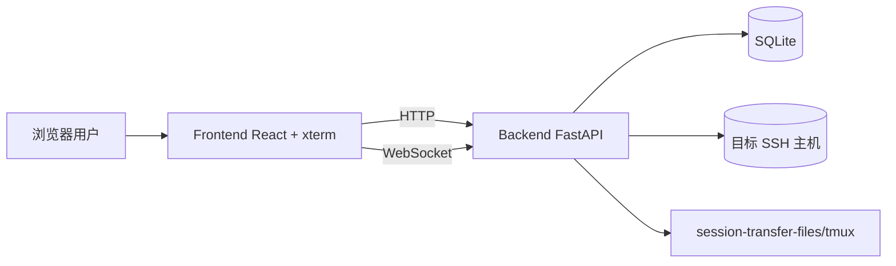

# 架构说明（社区版）

> English version: [ARCHITECTURE.en.md](./ARCHITECTURE.en.md)

## 1. 总体架构

WebSSH Gateway 采用前后端分离架构，后端负责鉴权、SSH 会话和业务 API，前端负责会话交互、可视化和文件操作。

## 2. 后端模块拆分

- `app/main.py`：应用启动、路由注册、静态资源挂载、会话状态初始化。
- `app/api/`：REST + WebSocket 接口层。
- `app/services/`：鉴权、加密、SSH 会话管理、会话状态广播等核心业务。
- `app/models/`：SQLAlchemy 模型（用户、连接、会话）。
- `app/core/`：配置、数据库、日志、应用状态装配。

### 2.1 接口分层

- `auth.py`：登录、改密。
- `connections.py`：连接管理（增删改查）。
- `sessions.py`：会话创建、查询、重试、断开、备注、终端 WebSocket。
- `ws_sessions.py`：会话状态广播 WebSocket。
- `system.py`：系统监控 + 文件管理能力。
- `health.py`：健康检查。

## 3. 前端模块拆分

- `src/pages/Login.tsx`：登录页。
- `src/pages/Sessions.tsx`：连接与会话管理页。
- `src/pages/Terminal.tsx`：终端页（xterm + 文件侧栏 + 系统监控）。
- `src/components/FileBrowser.tsx`：远程文件操作 UI。
- `src/components/SystemMonitor.tsx`：监控面板。
- `src/lib/api.ts`：统一 API 封装、错误处理、鉴权头处理。
- `src/context/AppContext.tsx`：主题与网络状态上下文。

## 4. 核心数据流

### 4.1 登录与鉴权

1. 前端调用 `/auth/login`。
2. 后端校验用户名密码、失败次数与锁定状态。
3. 返回 JWT，前端存储在 `localStorage` 或 `sessionStorage`。
4. 后续请求通过 `Authorization: Bearer <token>` 访问受保护 API。

### 4.2 终端会话

1. 前端创建会话 `/sessions`。
2. 后端解密连接凭据，建立 SSH 连接并创建 PTY。
3. 前端连接 `/sessions/ws/terminal/{session_id}`。
4. 终端输入通过 WebSocket 下发到 SSH，输出实时回传。

### 4.3 增强会话持久化

增强模式依赖 `session-transfer-files/tmux` 下的保活二进制与远端 `tmux`。

- 会话断开后会进入 `disconnected` 状态。
- 后台 worker 基于重试间隔策略自动尝试恢复。
- 恢复成功后状态回推给前端。

## 5. 存储模型

- `users`：用户、密码哈希、锁定状态、最后登录时间。
- `connections`：SSH 连接信息、凭据密文、远端平台信息。
- `sessions`：会话状态、PTY 信息、增强模式参数、重试计数等。

## 6. 安全设计

- 凭据加密：连接凭据使用 AES-GCM 加密后持久化。
- 密码策略：要求复杂度并支持首次登录强制改密。
- 登录风控：失败次数达到阈值后短时锁定。
- API 鉴权：JWT + issuer 校验。
- 日志追踪：请求级 request-id，便于审计与定位。

## 7. 社区版与付费版边界

当前社区版提供“可独立部署的完整基础能力”。

项目后续存在付费开发方向意向，但具体能力范围、交付形式与时间计划 **待定**。
在此之前，社区版持续作为可独立部署的开源版本演进。
